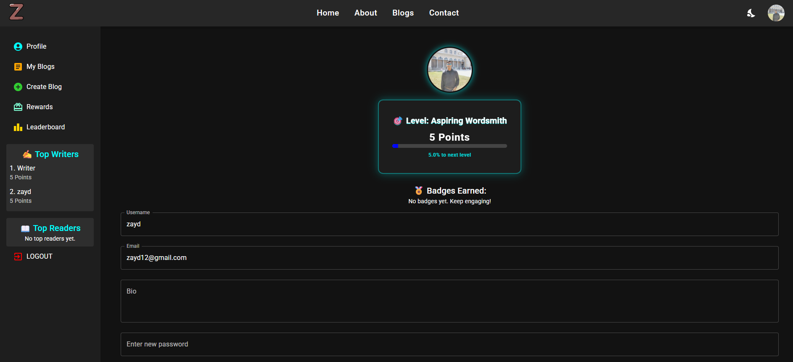
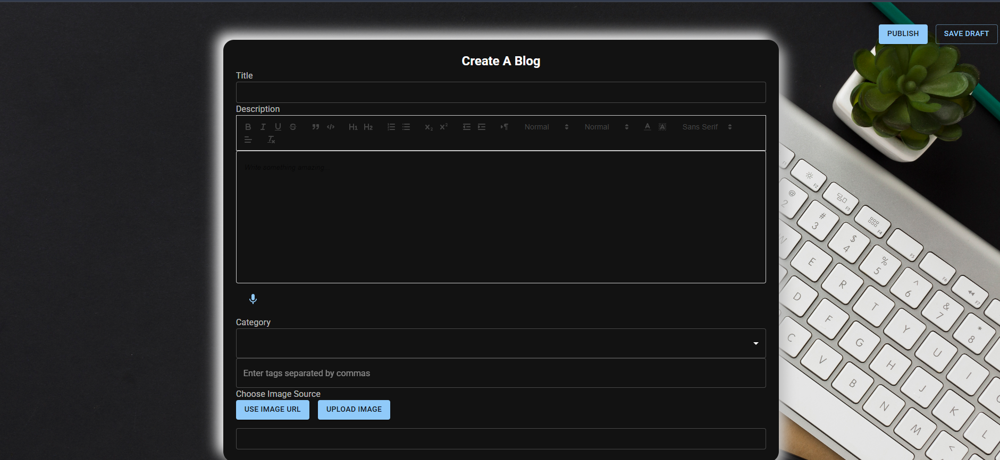

# Inkwell — MERN Blog Platform 

> A production-grade, full-stack blogging platform: writers publish, readers
> engage, and a server-side points/levels system rewards meaningful
> participation. Built on the MERN stack with a hardened JWT auth layer,
> server-side point awarding, transactional data writes, and a Vite-powered
> React frontend.

---

## ✨ Features

- **Auth & RBAC** — JWT access + rotated httpOnly refresh tokens, three roles
  (`Reader`, `Writer`, `Admin`), ownership-scoped mutations, admin-only
  moderation endpoints.
- **Blogging** — create / edit / delete / publish blogs with drafts, rich-text
  (Quill) sanitization on write, category & tag filtering, trending &
  recommendations.
- **Engagement** — comments with threaded replies, likes (unique per user per
  blog, enforced at the DB), comment reporting + admin moderation queue.
- **Gamification** — server-side point awarding (publish / read / comment /
  receive-comment), four level bands, a redeemable rewards store, and a
  leaderboard of top writers & readers.
- **UX** — light/dark theme, responsive layouts, skeleton loading states,
  validate-on-blur field validation, paginated comment loading, accessible
  forms.

---

## 🛠️ Tech Stacks

| Layer | Technology |
|-------|------------|
| Frontend | React 18, Vite 6, Material UI, Tailwind, Framer Motion, Redux Toolkit, React Router 7 |
| Rich text | Quill (with DOMPurify sanitization) |
| Auth client | Firebase Auth (password-reset email) |
| Backend | Node.js, Express 4 |
| Database | MongoDB via Mongoose 8 |
| Auth server | JWT (`jsonwebtoken`), bcryptjs, httpOnly refresh cookies |
| Security | Helmet, express-rate-limit, express-mongo-sanitize, Zod request validation |
| Mail | Nodemailer (contact form + newsletter) |

---

## 📸 UI Screenshots

### 🏠 Home Page


### 📰 Blog Details Page


### 🧩 Featured Blogs + Tags + Trending


### 👤 User Dashboard (Level + Leaderboard)


### 📝 Create Blog Editor


---

## 🚀 Getting Started

### Prerequisites

- Node.js 18+
- A running MongoDB instance (local or Atlas)
- (Optional) A Firebase project for password-reset emails — a built-in
  fallback config is used if unset, so the app runs out of the box in dev.

### 1. Install dependencies

```bash
# Backend
cd server
npm install

# Frontend (separate terminal)
cd ../client
npm install
```

### 2. Configure environment variables

Copy each `.env.example` to `.env` and fill in real values.

**`server/.env`** — see `server/.env.example`:

```env
NODE_ENV=development
DEV_MODE=development
PORT=8080

# MongoDB (note: the server reads MONGO_URL, not MONGO_URI)
MONGO_URL=mongodb://127.0.0.1:27017/blog-app

# JWT auth — generate with:
#   node -e "console.log(require('crypto').randomBytes(64).toString('hex'))"
JWT_SECRET=<long_random_hex>
JWT_REFRESH_SECRET=<another_long_random_hex>   # optional; falls back to JWT_SECRET
JWT_EXPIRES_IN=15m
JWT_REFRESH_EXPIRES_IN=7d

# CORS — the allowed client origin(s)
CLIENT_URL=http://localhost:3000

# Nodemailer (Gmail app password) — contact form + newsletter
EMAIL_USER=your_email@example.com
EMAIL_PASS=your_gmail_app_password

# File uploads
UPLOAD_DIR=uploads
MAX_UPLOAD_MB=5
```

**`client/.env`** — see `client/.env.example`. Firebase config is read from
`VITE_FIREBASE_*` vars; a fallback is used when they're unset, so this is
optional for local dev but should be set to your own project for production.

### 3. Run in development

```bash
# Terminal 1 — backend (http://localhost:8080)
cd server
npm run dev

# Terminal 2 — frontend (http://localhost:3000)
cd client
npm run dev
```

The Vite dev server proxies `/api` and `/uploads` to the backend
(see `client/vite.config.js`), so the refresh-token cookie (SameSite=Lax)
works in development.

### 4. Production build

```bash
# Build the client into client/build (served by Express in production)
cd client
npm run build

# Run the server (it serves the built client + SPA fallback)
cd ../server
npm start
```

---

## ⚠️ Creating the first Admin

**Registration always creates a `Reader` account** — the role is enforced
server-side and cannot be set from the signup form. To bootstrap an admin:

**Option A — promote an existing user via the API** (requires an already-admin
token, so use this only once there is an admin, or for additional admins):

```bash
curl -X PATCH http://localhost:8080/api/v1/admin/users/<USER_ID>/role \
  -H "Authorization: Bearer <ACCESS_TOKEN>" \
  -H "Content-Type: application/json" \
  -d '{"role":"Admin"}'
```

The endpoint is guarded by `isAdmin` and refuses to demote the last remaining
admin.

**Option B — set it directly in MongoDB** (for the *first* admin, before any
admin exists):

```js
// mongo shell
db.users.updateOne(
  { email: "your@email.com" },
  { $set: { role: "Admin" } }
)
```

---

## 🔐 Security & Architecture

This project was hardened from a typical tutorial codebase into a
production-shaped application. Notable work:

**Authentication**
- JWT access tokens (15m, in memory) + refresh tokens (7d, httpOnly +
  `Secure`/`SameSite` cookies, rotated on each refresh).
- `authenticateUser` (required) and `optionalAuth` (populates `req.user` if a
  token is present, continues anonymously otherwise) middlewares.
- Logout invalidates the server-side refresh record.

**Authorization / data integrity**
- Ownership checks on every blog/comment mutation (author or Admin only).
- Author identity is always taken from the verified token — never from the
  request body (which was spoofable in the original code).
- Cascade deletes (blog → its comments + likes) wrapped in a MongoDB
  transaction.
- Publish-point awarding made atomic with the status save via a transaction,
  so a "Published" blog always has its points; re-publishing an
  already-published blog earns nothing (no point farming by toggling status).

**Gamification**
- Points are awarded **server-side only** (`awardActivity`), so they can't be
  farmed through a client endpoint. Admins earn 0; points are floored at 0.
- Read points deduped via a `BlogView` unique compound index
  `{blog_id, user_id}` (duplicate-key 11000 = already viewed → skip award).
- Level bands (0 → *Aspiring Wordsmith*, 500 → *Engaged Contributor*,
  1000 → *Influencer*, 3000 → *Master Storyteller*) derived from the server's
  `getLevel` thresholds and mirrored on the client.

**Input handling**
- Zod validation on all request bodies/schemas; MUI validate-on-blur field
  validation on the client.
- Rich-text HTML sanitized with DOMPurify on write (stored XSS prevention).
- `express-mongo-sanitize` strips `$`/`.` keys; Helmet sets security headers;
  `express-rate-limit` throttles auth endpoints.

**Performance / scalability**
- Server-side pagination (`parsePagination` / `paginateMeta`, default limit 9,
  max 50) on blog lists, category/tag browse, and comments — backward
  compatible (comments return the full list when no `limit` is sent).
- DB indexes supporting the real query patterns: unique
  `{blog_id, user_id}` on likes & blog-views, `{blog_id, created_at}` and
  `{user_id}` on comments & likes, etc.
- Trending computed via `$lookup` over the real like/comment collections
  (the old denormalized `blog.likes`/`blog.comments` arrays were never kept in
  sync and were removed).
- Vite manual chunking splits large vendor groups (MUI, Firebase, Quill,
  charts, motion) into stable cacheable chunks.

**Frontend hygiene**
- Migrated from Create React App to Vite 6 (JSX-in-`.js` loader config).
- `useAuth()` context as the single source of truth for the current user
  (replacing spoofable `localStorage` reads).
- Inline `<style>` blocks extracted into scoped CSS files using CSS custom
  properties for theme reactivity (the custom ThemeContext sets no
  data-attribute on the root).
- Removed fake/dummy data and deprecated external image fallbacks in favor of
  real API fetches with skeleton / error / empty states.

---

## 📁 Project Structure

```
MERN Blog App/
├── client/                 # React + Vite frontend
│   ├── src/
│   │   ├── admin/           # Admin panel
│   │   ├── context/         # AuthContext, ThemeContext
│   │   ├── firebase/        # Firebase config (password reset)
│   │   ├── pages/           # Home, Blogs, BlogDetails, Profile, ...
│   │   ├── redux/           # Redux Toolkit store
│   │   └── utils/           # validate.js, auth.js
│   ├── vite.config.js
│   └── .env.example
├── server/                  # Express + Mongoose backend
│   ├── config/              # db.js, upload.js
│   ├── controllers/         # blog, comment, user, admin, ...
│   ├── middleware/          # auth, rbac, validation
│   ├── models/              # Mongoose schemas + indexes
│   ├── routes/
│   ├── utils/               # points.js, pagination.js, tokenUtils.js, sanitize.js
│   ├── server.js
│   └── .env.example
└── README.md
```

---

## 📜 Scripts

| Command | Where | Purpose |
|---------|-------|---------|
| `npm run dev` | server | Start backend with nodemon |
| `npm start` | server | Start backend (node) |
| `npm run dev` | client | Vite dev server (port 3000) |
| `npm run build` | client | Production build into `client/build` |
| `npm run preview` | client | Preview the production build |

---

## 📝 License

ISC — authored by zayd.
