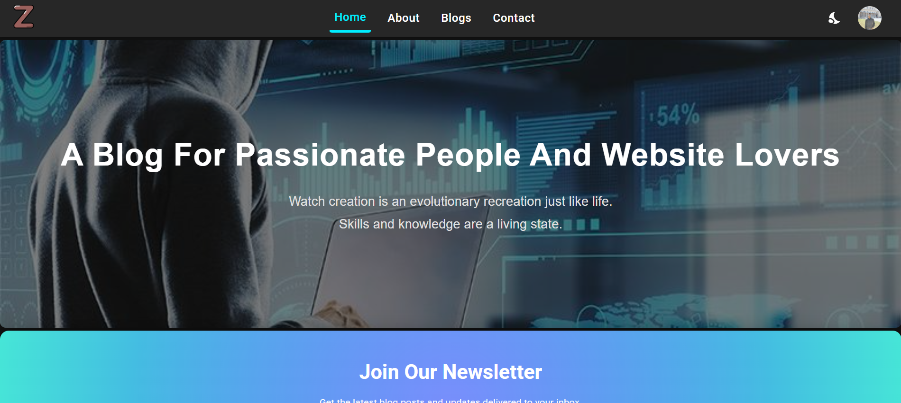
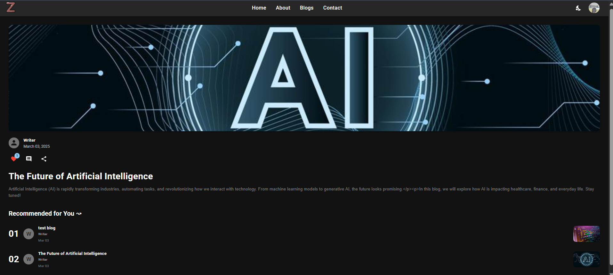
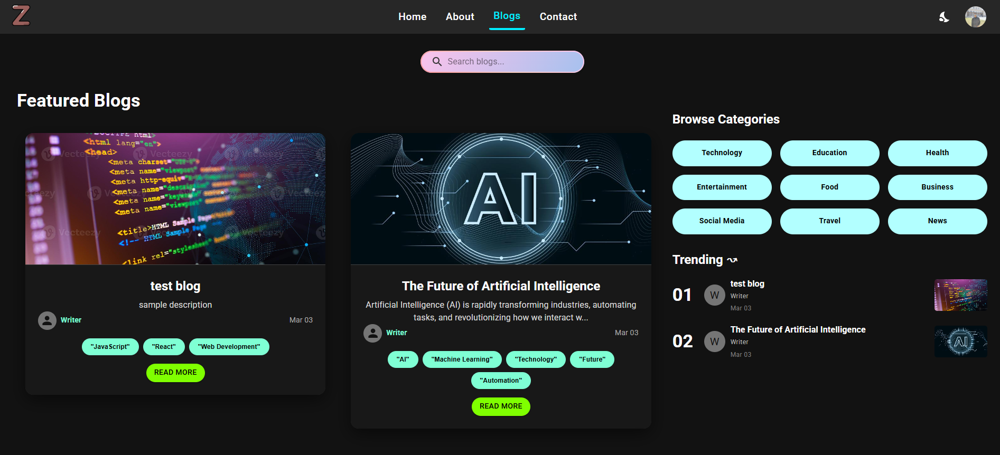
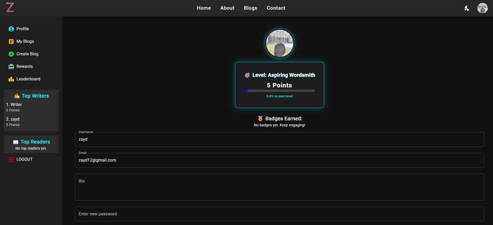
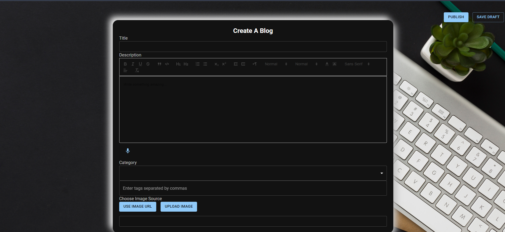

# 🌐 MERN Blog App



> ✍️ A dynamic full-stack blog platform built with the MERN stack, empowering passionate readers and writers to engage, explore, and express.

---

## 🚀 Features

- 📝 Create, read, edit, and delete blogs
- 🔐 Secure authentication with RBAC (Role-Based Access Control)
- 💬 Commenting, liking, and sharing functionality
- 🧠 Category & tag-based blog filtering
- 📨 Newsletter subscription system
- 🏆 Writer levels, rewards, and leaderboard system
- 📱 Responsive design using Tailwind CSS

---

## 🛠️ Tech Stack

**Frontend:**  


**Backend:**  


**Other Tools:**  


---

## 📸 UI Screenshots

### 🏠 Home Page


### 📰 Blog Detail Page


### 🧩 Featured Blogs + Tags + Trending


### 👤 User Dashboard (Level + Leaderboard)


### 📝 Create Blog Editor


---

#### 🔐 `.env` Setup (inside `/server`)

Create a `.env` file with the following keys:

#```env
DEV_MODE=development
PORT=8080
MONGO_URI=your_mongodb_connection_string
EMAIL_USER=your_email@example.com
EMAIL_PASS=your_app_password

###### ⚙️ Getting Started

# Clone the repository
git clone 

# Install client dependencies
cd client

npm install

# Install server dependencies
cd server

npm install

# Run the development servers
# Start backend

npm run server

# In a separate terminal
cd client

npm start
